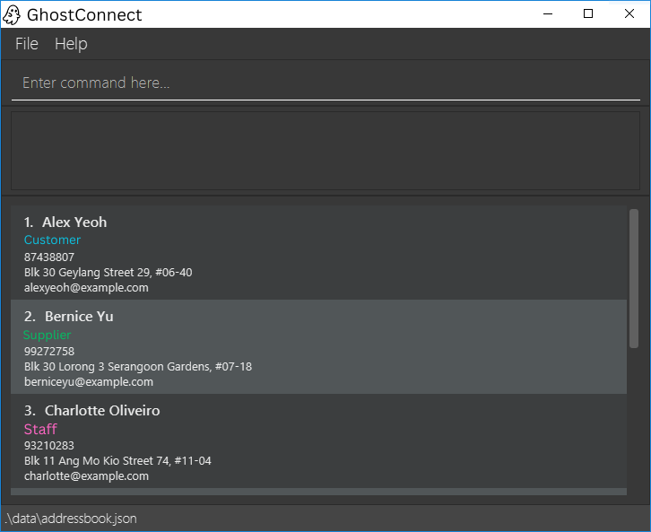

# GhostConnect

GhostConnect is a desktop application designed for **tech-savvy ghost kitchen managers** to manage diverse contacts efficiently.

---

## Target Users

- Tech-savvy ghost kitchen managers
- Users who need to manage suppliers, delivery riders, staff, and partner brands

---

## Value Proposition

Our app helps ghost kitchen managers manage contacts in fast-paced delivery-only food businesses. It offers:

- Categorisation of contacts (supplier, staff, partner brands, delivery riders)  
- Relationship linking  
- Quick fuzzy search  
- Archiving of inactive contacts  

This solves the problem of **high turnover and fragmented contact information**.

---

## Contact Information to Track

Each contact entry contains the following required information:

- Name  
- Contact Number  
- Address  
- Email  
- Category  

---

## MVP Features

### Add Contacts
- Users can create a new contact entry.
- Required fields: Name, Contact Number, Address, Email, and Relationship Category.

### Delete Contacts
- Users can remove existing contacts.
- Deletion is done through a **unique identifier**.

### Search Contacts
- Users can search for entries by name.

### View Contact List
- The system displays all contacts in a structured list format.
- Each contact shows basic details: Name, Contact Number, Category.

---

## Acknowledgment

This project is based on the AddressBook-Level3 project created by the [SE-EDU initiative](https://se-education.org).
