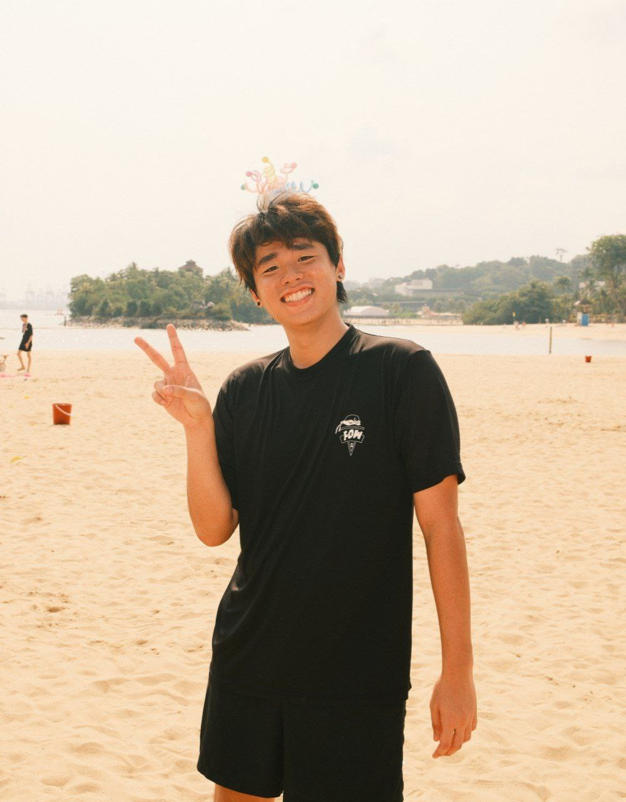
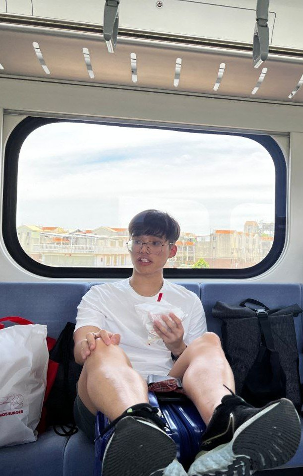
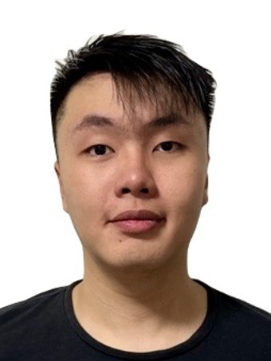

# About Us

We are a team based in the [School of Computing, National University of Singapore](http://www.comp.nus.edu.sg).

You can reach us at the email `seer[at]comp.nus.edu.sg`

## Project team

### Jingling

[[homepage](http://www.comp.nus.edu.sg/~damithch)]
[[github](https://github.com/b33pbop)]
[[portfolio](team/johndoe.md)]

* Role: Project Advisor

### Adriel Toh

[[github](http://github.com/adrieltch)]
[[portfolio](team/adrieltch.md)]

* Role: Team Lead
* Responsibilities: UI

### Gerron Lee

[[github](http://github.com/garennotjeron)] 
[[portfolio](team/johndoe.md)]

* Role: Developer
* Responsibilities: Data

### Kane Ng

[[github](http://github.com/WeeMee03)]
[[portfolio](team/johndoe.md)]

* Role: Developer
* Responsibilities: Dev Ops + Threading

### Aden Chan

[[github](http://github.com/Haffner32)]
[[portfolio](team/johndoe.md)]

* Role: Developer
* Responsibilities: UI
