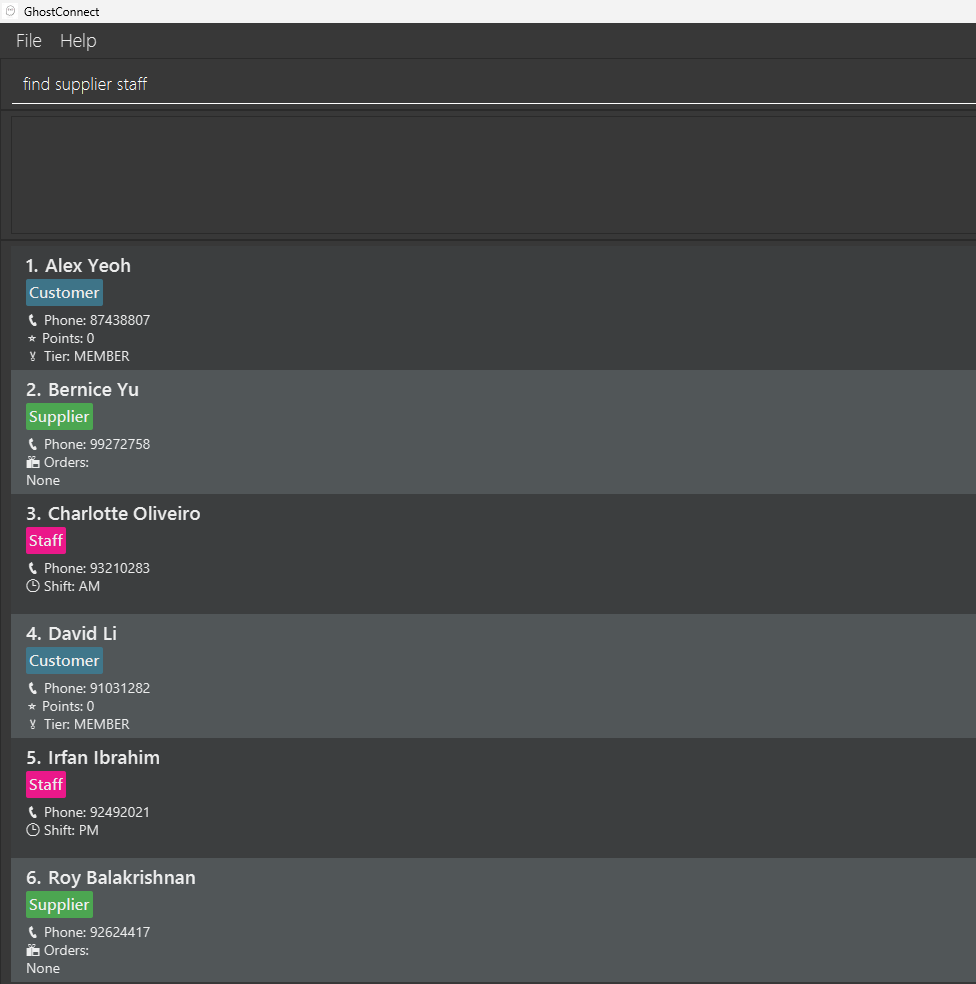
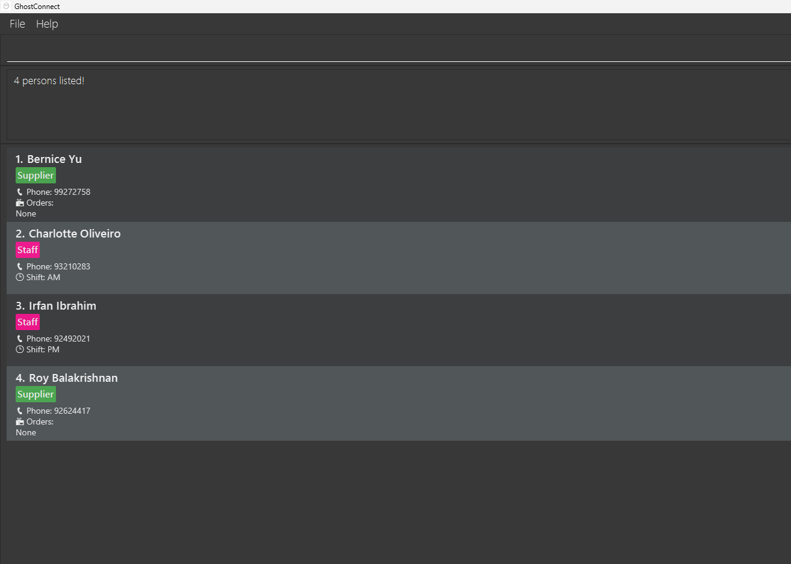
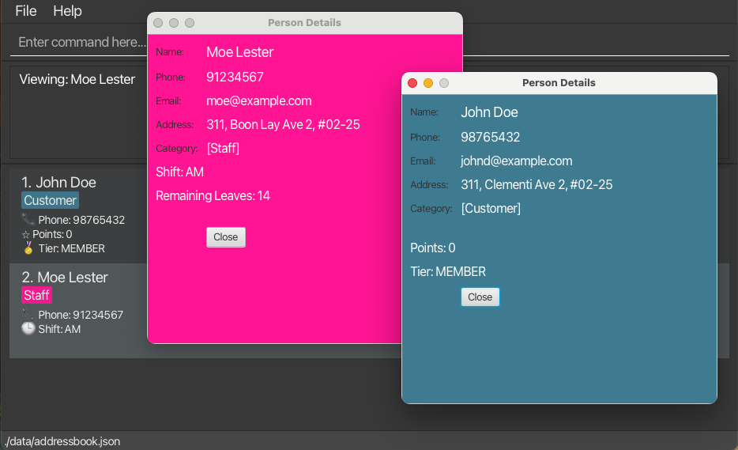
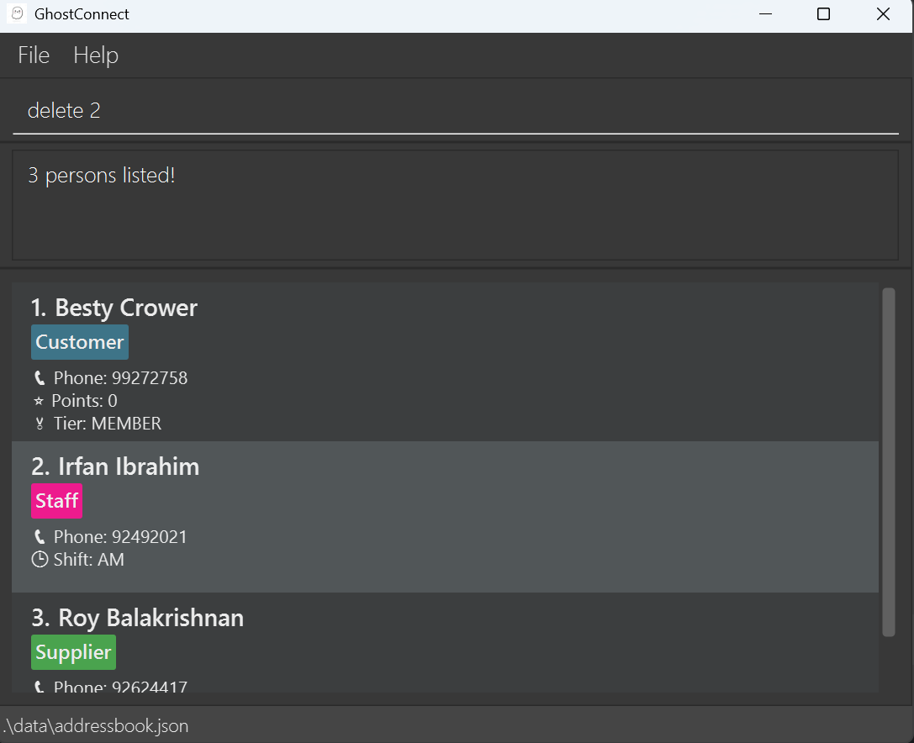
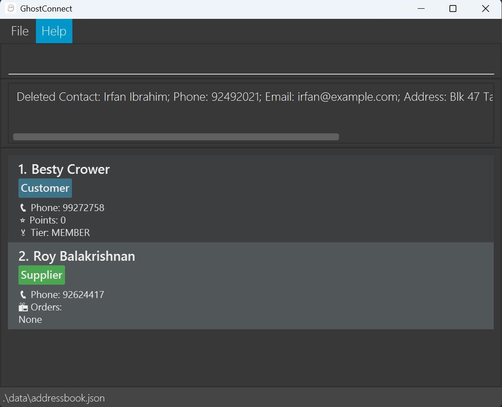
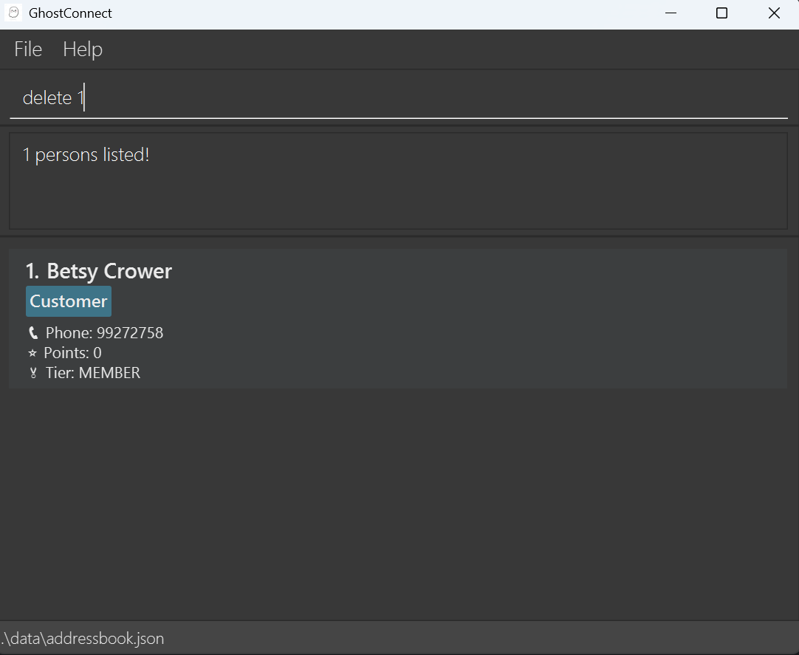
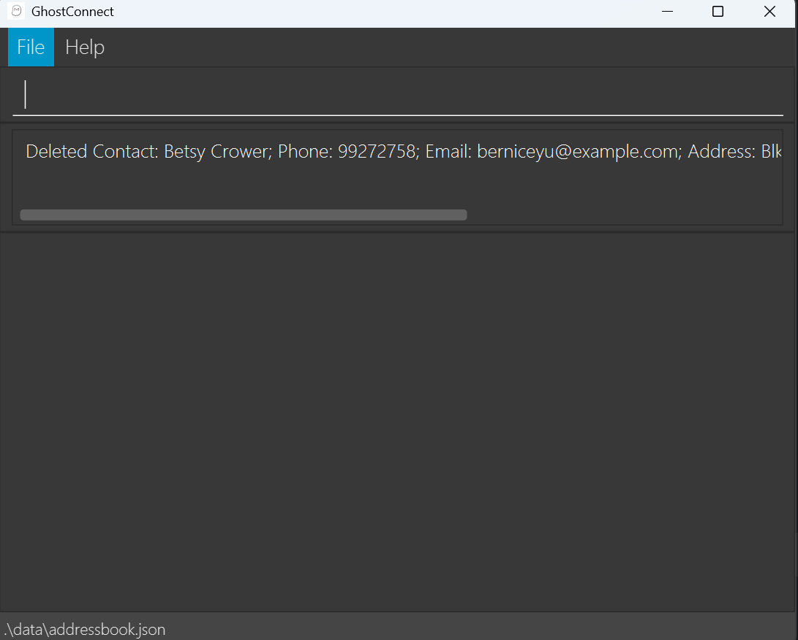
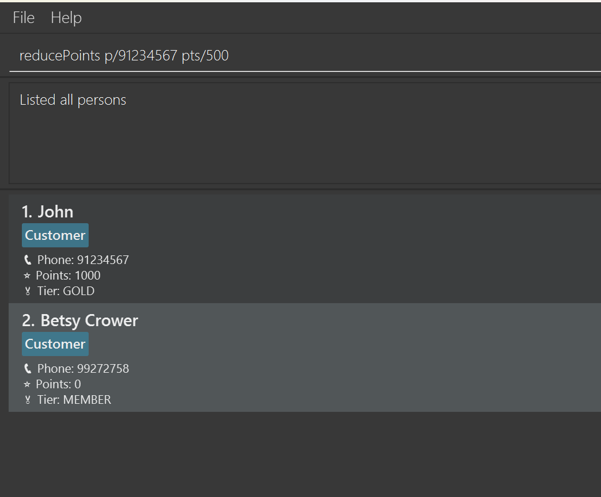
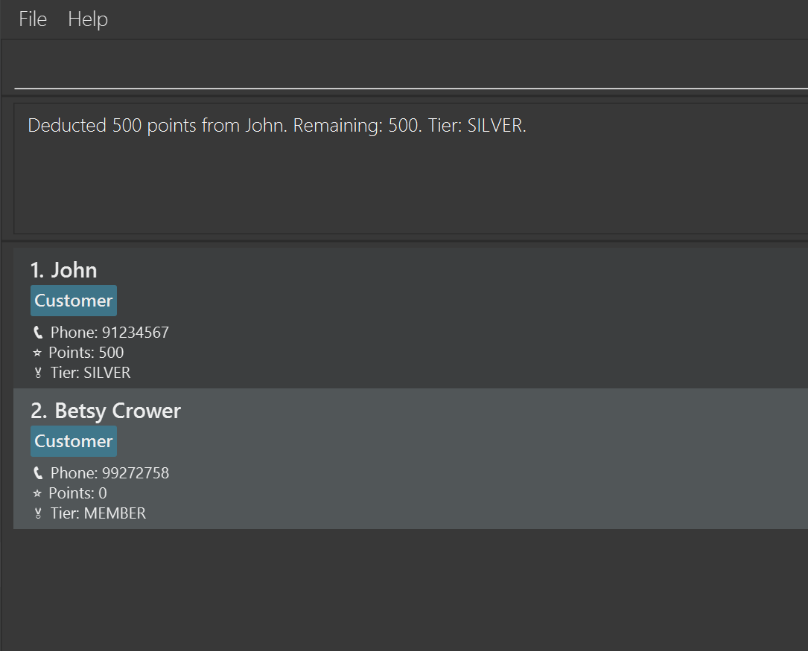

# GhostConnect User Guide

Hey Ghost Kitchen Managers! 

Welcome to **GhostConnect**, a desktop application designed for managing contacts **quickly and efficiently** for our target users: the **ghost kitchen managers**. 

Ghost kitchen managers oversee the operations of a ghost kitchen, which produces meals exclusively for delivery and takeout, without a traditional space to dine in.

Keeping that in mind, this application aims to help for **tech-savvy ghost kitchen managers** who oversee multiple aspects of their business, including **staff coordination, supplier management, and customer engagement through loyalty programs**. Our target audience values **efficiency, accuracy, and organization**, and seeks tools that allow them to manage complex information quickly without sacrificing clarity.

GhostConnect combines the **speed and precision of a Command Line Interface (CLI)** with the **visual clarity of a Graphical User Interface (GUI)**, giving users the flexibility to work in the way that suits them best.

With Ghost Connect, users will be able to add, edit, delete and categorise their contact entries into 3 categories: Customers, Suppliers and Staff. 
Users will also have access to various category specific functions depending on the entry's category, which include the following:
- Staff: Updating of Shifts
- Customer: Updating of Points
- Suppliers: Adding, Updating and Deleting of Orders

Assumptions:
- We assume that users are familiar with basic computing concepts such as **file management, shortcuts, and command-based operations**, and are comfortable using tools that **streamline repetitive tasks** and **handle multiple contacts simultaneously**. 
- We assume that all ghost kitchen managers using the application reside within Singapore and only have external contacts within Singapore as well. This implies that all contact entries into GhostConnect are to only include Singaporean numbers.
- We assume that orders under Suppliers in GhostConnect will be made with Singaporean currency and that ordered items are countable and do not need suffixes to determine quantity (e.g. kg).

By the end of this guide, users will be able to **navigate GhostConnect confidently**, leverage its **advanced features**, and integrate it seamlessly into their daily operations to manage staff, suppliers, and customer loyalty programs efficiently.

## Table of Contents

- [Quick Start](#quick-start)
- [Parameters](#parameters)
- [Features](#features)
  - [General Commands](#general-commands)
    - [Help](#accessing-the-help-page-help)
    - [Adding a Contact](#adding-a-contact-add)
    - [Listing all Contacts](#listing-all-contacts-list)
    - [Editing a Contact](#editing-a-contact-edit)
    - [Locating Contacts by Name or Category](#locating-contacts-by-name-or-category-find)
    - [Viewing additional info for a Contact](#viewing-additional-info-for-a-contact-view)
    - [Deleting a Contact](#deleting-a-contact-delete)
    - [Clearing all Contacts](#clearing-all-contacts-clear)
    - [Exiting the Program](#exiting-the-program-exit)
  - [Category Specific Commands](#category-specific-commands)
    - [Adding Points to a Customer](#adding-points-to-a-customer-updatepoints)
    - [Reducing Points for a Customer](#reducing-points-for-customer-reducepoints)
    - [Summary of Customers](#view-summary-of-customers-customersummary)
    - [Changing Shift of a Staff](#changing-shift-of-a-staff-updateshift)
    - [Adding Order from a Supplier](#adding-order-from-a-supplier-addorder)
    - [Updating Order from a Supplier](#updating-order-from-a-supplier-updateorder)
    - [Deleting Order from a Supplier](#deleting-order-from-a-supplier-deleteorder)
  - [Miscellaneous](#miscellaneous)
    - [Saving the Date](#saving-the-data)
    - [Editing the Data File](#editing-the-data-file)
- [FAQ](#faq)
- [Known Issues](#known-issues)
- [Command Summary](#command-summary)

<page-nav-print />

--------------------------------------------------------------------------------------------------------------------

## Quick Start

1. Ensure you have Java `17` or above installed in your Computer. 
   **Mac users:** Ensure you have the precise JDK version prescribed [here](https://se-education.org/guides/tutorials/javaInstallationMac.html).

2. Download the latest `.jar` file from [here](https://github.com/AY2526S1-CS2103T-W12-2/tp/releases).

3. Copy the file to the folder you want to use as the _home folder_ for GhostConnect.

4. Open a command terminal, `cd` into the folder you put the jar file in, and use the `java -jar ghostConnect.jar` command to run the application. 
   A GUI similar to the below should appear in a few seconds. Note how the app contains some sample data. 

   

5. Type the command in the command box and press Enter to execute it. e.g. typing **`help`** and pressing Enter will open the help window. 
   Some example commands you can try:

    * `list` : Lists all contacts.
    * `add n/John Doe p/98765432 e/johnd@example.com a/311, Clementi Ave 2, #02-25 c/Customer` : Adds a customer contact named `John Doe` to the Address Book.
    * `delete 3` : Deletes the 3rd contact shown in the current list.
    * `clear` : Deletes all contacts.
    * `exit` : Exits the app.

6. Refer to the [Features](#features) below for details of each command.

--------------------------------------------------------------------------------------------------------------------
## Parameters

Many commands make use of the same parameters with identical validation rules. Listed below are the parameter types
used in GhostConnect.

### Person General Parameters
Below are the core parameters that will be required when creating an entry for any Person.

| Parameter             | Validation Requirements                                                                                                                                                                                                                                 | Remarks                                                                                                                          |
|:----------------------|:--------------------------------------------------------------------------------------------------------------------------------------------------------------------------------------------------------------------------------------------------------|:--------------------------------------------------------------------------------------------------------------------------------------|
| **NAME**              | - Only alphanumeric characters and one pair of brackets at the end allowed                                                                                                                                                                          | **Readability**: Ensures names are readable and properly stored in the system                                                         |
| **PHONE NUMBER**      | - 8 Digits long  - Starts with either 6, 8 or  9                                                                                                                                                                                                    | **Singaporean Audience**: GhostConnect caters to the Singaporean market and thus phone numbers have to be a valid Singaporean number. |
| **EMAIL**             | - **Local part** (before '@'): contains letters, digits or `+_.-` only - No **consecutive** special characters  - Cannot **start/end** with special character  - **Domain** (after '@): valid labels separated by `.`, last label ≥ 2 chars | **Data Integrity**: Ensures emails are correctly formatted to prevent errors and maintain compatibility with systems.                 |
| **ADDRESS**           | - Only letters, digits or `',-#` and spaces allowed - Length between 2 and 100 characters                                                                                                                                                           | **Address Validation**: Ensures addresses are valid, readable, and concise.                                                           |
| **CATEGORY**          | - Can only belong to 1 of the three categories: Customer, Staff or Supplier                                                                                                                                                                             | **Category Relevance**: Ensures contacts are correctly classified for operational use.                                                |

In GhostConnect, all contacts share a common set of basic parameters regardless of their category. These parameters form the foundation of each contact record and are used across all contact types (Customer, Staff, and Supplier).

### Staff Specific Parameters
Staff contacts have an additional parameter specific to employee management for shift scheduling. This helps ghost kitchen managers efficiently organize their workforce.

| Parameter             | Validation Requirements       | Remarks                        |
|:----------------------|:------------------------------|:-------------------------------|
| **SHIFT**             | - Can only be either AM or PM |                                |

### Supplier Specific Parameters
In GhostConnect, suppliers are a subset of persons but with additional parameters, which stores a list of their Orders.
The parameters listed below are fields that belong to an Order.

| Parameter             | Validation Requirements                                                                             | Remarks                                                                                                                           |
|:----------------------|:----------------------------------------------------------------------------------------------------|:----------------------------------------------------------------------------------------------------------------------------------|
| **ORDER INDEX**       | - Can only be positive integer values (Higher than 0)  - Value must be lower than 2,147,483,647 | GhostConnect implements this to ensure valid index values and prevent overflow.                                                   |
| **ITEM NAME**         | - Only alphanumeric characters and spaces are allowed.                                              | No further restrictions put in place to give users flexibility in describing Item Name                                            |
| **ITEM QUANTITY**     | - Only positive integer values are allowed.                                                         | Restrictions set to allow numbers only with the assumption that ordered items are countable and can be denoted with numbers alone |
| **ITEM UNIT PRICE**   | - Only positive numerical values with strictly 2 decimal places are allowed.                        | Strictly requires 2 decimal places to ensure that value given is following Singaporean currency.                                  |
| **ITEM DELIVERY DAY** | - Only alphanumeric characters and spaces are allowed.                                              | No further restrictions put in place to give users flexibility in describing Item Delivery Day                                    |                                                                                 |

### Customer Specific Parameters
In GhostConnect, customers are a subset of persons but with additional parameters, which tracks a Customer's membership progress.

| Parameter             | Validation Requirements | Remarks                                                                                        |
|:----------------------|:------------------------|:-------------------------------------------------------------------------------------------------|
| **BILL AMOUNT**       | - Cannot be negative    | **Prevent invalid input**: Ensures the bill amount is realistic and prevents calculation errors. |

--------------------------------------------------------------------------------------------------------------------
## Features

<box type="info" seamless>

**Notes on Command Format:** 

* Parameters in `UPPER_CASE` are supplied by the user.
  - Example: `add n/NAME` → `add n/John Doe`. 
     
* Some fields are **optional** and shown in `[]` brackets.
  - Example: `[p/PHONE]` is optional unless otherwise stated. 
     
* Parameters can be entered in **any order**.
  - Example: `n/NAME p/PHONE` is equivalent to `p/PHONE n/NAME`. 
     
* Extraneous parameters for **commands without arguments** will be ignored.
  - Example: `help 123` will be interpreted as `help`. 
     
* On the other hand, other commands that take in parameters will throw an error if extra parameters / preamble is given.
    - Example: if the command specifies `delete abc 1`, an error will be thrown.
     
* Commands are **case-insensitive**.
  - Example: `list`, `LIST`, or `LiSt` are all valid. 
     
* For **PDF users**: be careful when copying multi-line commands, as spaces at line breaks may be omitted.

</box>

### General Commands

#### **Accessing the Help Page: `help`**

<box type="definition">

Shows a pop-up window which provides a detailed guide on the commands available.

</box>

Format: `help`

<box type="tip" seamless>

**Tip:** Click on the button on the bottom to copy the User Guide URL into your clipboard and paste it into your browser to access the full User Guide online!

</box>

#### **Adding a Contact: `add`**

<box type="definition">

Adds a person to the address book.

</box>

Based on the category you give the contact, they unlock [different commands](#category-specific-commands)!

Format: `add n/NAME p/PHONE e/EMAIL a/ADDRESS c/CATEGORY`

Hey! We understand the table [above](#person-general-parameters) may look scary which is why we have **error messages** for each field to guide your experience in the app:

| Parameter        | Invalid Example      | Error Message when invalid                                                                                                                                                                                                                                                                                                                                                                                                                                                                                                                                                                                                                                             |
|:-----------------|:---------------------|:-----------------------------------------------------------------------------------------------------------------------------------------------------------------------------------------------------------------------------------------------------------------------------------------------------------------------------------------------------------------------------------------------------------------------------------------------------------------------------------------------------------------------------------------------------------------------------------------------------------------------------------------------------------------------|
| **NAME**         | John (Food) Doe      | Names should only contain alphanumeric characters and spaces, and it should not be blank.  Only one pair of brackets are allowed to indicate tags.  The opening bracket must be closed.  No characters after the brackets are allowed.                                                                                                                                                                                                                                                                                                                                                                                                                     |
| **PHONE NUMBER** | 999                  | Phone numbers must only have 8 digits and start with 6, 8 or 9.                                                                                                                                                                                                                                                                                                                                                                                                                                                                                                                                                                                                        |
| **EMAIL**        | bad+=_.@example      | Emails should be of the format local-part@domain and adhere to the following constraints: 1. The LOCAL-PART (before '@') must: only contain LETTERS, DIGITS, and these SPECIAL CHARACTERS: +_.-; have at most one SPECIAL CHARACTER between LETTERS/DIGITS (no consecutive special characters); not start or end with any SPECIAL CHARACTERS. 2. The DOMAIN (after '@') must: be made up of DOMAIN LABELS separated by periods; end with a DOMAIN LABEL that is at least 2 LETTERS/DIGITS long; have each DOMAIN LABEL start and end with a LETTER/DIGIT; contain only LETTERS/DIGITS within each label, with optional HYPHENS allowed between LETTERS/DIGITS. |
| **ADDRESS**      | Yishun==             | Invalid characters found - only letters, numbers, apostrophes, commas, hyphens, hashes and spaces are allowed.                                                                                                                                                                                                                                                                                                                                                                                                                                                                                                                                                         |
| **ADDRESS**      | A                    | Length of Address does not match criteria - Address must be between 2 - 100 characters.                                                                                                                                                                                                                                                                                                                                                                                                                                                                                                                                                                                |
| **CATEGORY**     | Friend               | Unknown Category (Customer \| Supplier \| Staff)                                                                                                                                                                                                                                                                                                                                                                                                                                                                                                                                                                                                                       |

**If all the rules [above](#person-general-parameters) were followed you will see either of these 2 messages**:

- :white_check_mark:Success (yay!)
  - "New person added: NAME; Phone: PHONE; Email: EMAIL; Address: ADDRESS; Category: CATEGORY"
- :x:Failure (oh no!)
  - Duplicate Entry: "A contact with the name or number already exists in the book."

<box type="info">

**Duplicate Check**

Even if every field is valid, GhostConnect will prevent you from adding:
- a contact with a **name** that already exists, or
- a contact with a **phone number** that already exists.

This feature help prevent unnecessary clutter in your contact list!

</box>

<box type="tip">

**Need to add a contact with the same name?**

This is why we allow a **pair of brackets** at the end of the name to tag each contact!

E.g. Tom (Soon Seng Food Industry) & Tom (Lim Kian Seng Food Supplier) will not set off duplicate rules :smiley:

</box>

**Example**: 
A new **Customer**, **John Doe** signed up for membership, and you hired a new **Staff**, **Betsy Crowe**!
1. `add n/John Doe p/98765432 e/johnd@example.com a/John street, block 123, #01-01 c/Customer`  
2. `add n/Betsy Crowe e/betsycrowe@example.com a/Yishun p/68998899 c/Staff` 

#### **Listing all Contacts: `list`**

<box type="definition">

Shows a list of all persons in the address book.

</box>

Format: `list`

<box type="tip">

**When does this come in handy?**

You can use this command to bring back your full contact list after filtering with the [find command](#locating-contacts-by-name-or-category-find)!

</box>

#### **Editing a Contact: `edit`**

<box type="definition">

Edits an existing person in the address book.

</box>

Format: `edit INDEX [n/NAME] [p/PHONE] [e/EMAIL] [a/ADDRESS] [c/CATEGORY]`

| Parameter        | Invalid Example      | Error Message when invalid                                                                                                                                                                                                                                                                                                                                                                                                                                                                                                                                                                                                                                             |
|:-----------------|:---------------------|:-----------------------------------------------------------------------------------------------------------------------------------------------------------------------------------------------------------------------------------------------------------------------------------------------------------------------------------------------------------------------------------------------------------------------------------------------------------------------------------------------------------------------------------------------------------------------------------------------------------------------------------------------------------------------|
| **NAME**         | John (Food) Doe      | Names should only contain alphanumeric characters and spaces, and it should not be blank.  Only one pair of brackets are allowed to indicate tags.  The opening bracket must be closed.  No characters after the brackets are allowed.                                                                                                                                                                                                                                                                                                                                                                                                                     |
| **PHONE NUMBER** | 999                  | Phone numbers must only have 8 digits and start with 6, 8 or 9.                                                                                                                                                                                                                                                                                                                                                                                                                                                                                                                                                                                                        |
| **EMAIL**        | bad+=_.@example      | Emails should be of the format local-part@domain and adhere to the following constraints: 1. The LOCAL-PART (before '@') must: only contain LETTERS, DIGITS, and these SPECIAL CHARACTERS: +_.-; have at most one SPECIAL CHARACTER between LETTERS/DIGITS (no consecutive special characters); not start or end with any SPECIAL CHARACTERS. 2. The DOMAIN (after '@') must: be made up of DOMAIN LABELS separated by periods; end with a DOMAIN LABEL that is at least 2 LETTERS/DIGITS long; have each DOMAIN LABEL start and end with a LETTER/DIGIT; contain only LETTERS/DIGITS within each label, with optional HYPHENS allowed between LETTERS/DIGITS. |
| **ADDRESS**      | Yishun==             | Invalid characters found - only letters, numbers, apostrophes, commas, hyphens, hashes and spaces are allowed.                                                                                                                                                                                                                                                                                                                                                                                                                                                                                                                                                         |
| **ADDRESS**      | A                    | Length of Address does not match criteria - Address must be between 2 - 100 characters.                                                                                                                                                                                                                                                                                                                                                                                                                                                                                                                                                                                |
| **CATEGORY**     | Friend               | Unknown Category (Customer \| Supplier \| Staff)                                                                                                                                                                                                                                                                                                                                                                                                                                                                                                                                                                                                                       |

* Edits the person at the specified `INDEX`. The index refers to the index number shown in the displayed person list. The index **must be a positive integer** 1, 2, 3, …​
* **At least one** of the optional fields must be provided.
* Existing values will be **replaced** by the input values.
* **Name and Phone duplicate** check still holds when editing contacts.

<box type="important">

**Data Override**

When you change a contact’s **category**, GhostConnect will **automatically** clear fields from the **old category** and apply the fields for the new one.

</box>

**Examples:**

John recently changed his contact number and email!

* `edit 1 p/91234567 e/johndoe@example.com`
  Edits the phone number and email address of the 1st person to be `91234567` and `johndoe@example.com` respectively.

  <table>
    <tr>
      <td><strong>Before:</strong> </td>
      <td><strong>After:</strong> </td>
    </tr>
  </table>

You realized there was a typo for Betsy's name!

* `edit 2 n/Betsy Crower c/Customer`
  Edits the name of the 2nd person to be `Betsy Crower` and category to `Customer`.
   

  <table>
    <tr>
      <td><strong>Before:</strong> </td>
      <td><strong>After:</strong> </td>
    </tr>
  </table>

#### **Locating Contacts by Name or Category: `find`**

<box type="definition">

Finds persons whose **names** or **category** contain any of the given keywords.

</box>

Format: `find KEYWORD [MORE_KEYWORDS]`

* **Case-insensitive** — `hans` matches `Hans`.
* **Keyword order doesn’t matter** — `Hans Bo` matches `Bo Hans`.
* **Partial matches for names** — `Cho` matches `Nicholas`.
* **Exact matches for categories** — `find Cust` ❌ does NOT match `Customer`; use find Customer ✅.
* **OR-based search** — at least one keyword must match.

**Examples:**

* `find John` returns `john` and `John Doe`
* `find alex david` returns `Alex Yeoh`, `David Li`
* `find customer` returns all persons with `Customer` category
* `find staff supplier` returns all persons with categories `staff` or `supplier` 
  <table>
    <tr>
      <td><strong>Before:</strong> </td>
      <td><strong>After:</strong> </td>
    </tr>
  </table>

#### **Viewing additional info for a contact: `view`**

<box type="definition">

Opens a separate popup window showing all available details for the selected contact.

</box>

Format: `view p/PHONE`

| Parameter        | Invalid Example | Error Message when invalid                                      |
|:-----------------|:----------------|:----------------------------------------------------------------|
| **PHONE NUMBER** | A number        | Phone numbers must only have 8 digits and start with 6, 8 or 9. |

* The phone number entered must **exactly match** an existing contact.
* You can open **multiple** view windows at the same time — useful for comparing contacts.
* Each view window shows contact details with a category-specific background color:
  * **Customer**: Blue
  * **Staff**: Pink
  * **Supplier**: Green
 
* The view window displays **all stored fields** for that contact, including category-specific data:
  - **Customer**: Points and membership tier
  - **Staff**: Shift information and remaining leave count
  - **Supplier**: Full list of orders (scrollable)

<box type="tip">  

**Just made a big order with your supplier?**

You can scroll through the content if there are many details (e.g., a supplier with many orders).

</box>

**Examples:**

Hmm, what was John's email? Oh right let me use `view` to check!
* `view p/98765432` opens a view window showing details for the contact with phone number `98765432`
* `view p/91234567` opens another view window for a different contact

Note:
The view window is a separate popup that displays comprehensive contact information in a color-coded format. You can open multiple view windows at once to compare different contacts side-by-side.

#### **Deleting a Contact: `delete`**

<box type="definition">

Deletes the specified person from the address book.

</box>

Format: `delete INDEX`

| Parameter | Error Message when invalid                                       |
|:----------|:-----------------------------------------------------------------|
| **INDEX** | Please select valid index from 1 to (SIZE OF YOUR CONTACT LIST)! |

* Deletes the contact at the specified `INDEX`.
* `INDEX` refers to the index number shown in the **currently displayed contact list**.
* `INDEX` **must be a positive integer** 1, 2, 3, …​

<box type="important"> 

**This action is permanent**!

Deleted contacts **cannot** be recovered. 

</box>

**Examples:**

* `list` followed by `delete 2` deletes the 2nd person in the address book.

  <table>
    <tr>
      <td><strong>Before:</strong> </td>
      <td><strong>After:</strong> </td>
    </tr>
  </table>
 

* `find Betsy` followed by `delete 1` deletes the 1st person in the results of the `find` command.

  <table>
    <tr>
      <td><strong>Before:</strong> </td>
      <td><strong>After:</strong> </td>
    </tr>
  </table>

#### **Clearing all Contacts: `clear`**

<box type="definition">

Clears all entries from the address book.

</box>

Format: `clear`

#### **Exiting the Program: `exit`**

<box type="definition">

Exits the program and closes the GhostConnect window.

</box>

Format: `exit`
</box>

### Category Specific Commands

<box type="info" light>

From here onwards, all commands below uses `PHONE` to identify the contact.

</box>

#### **Adding Points to a Customer: `updatePoints`**

<box type="definition">

Award points for specified customer based of amount spent.

</box>

Format: `updatePoints p/PHONE b/BILL_AMOUNT`

* Bill amount can be any **positive number** with at most 2 decimal points 
  e.g. `50`, `50.15`, `50.1`

* Customers are **automatically assigned a tier** based on their accumulated points.

<box type="info" light>

**Current thresholds**:

* **Member**: 0.00 - 99.99 points
* **Bronze**: 100.00 - 499.99 points
* **Silver**: 500.00 - 999.99 points
* **Gold**: 1000.00 - 2499.99 points
* **Platinum**: 2500.00 points onwards. 

Each customer can accumulate up to a **maximum of 100,000 points.**

</box>

> _As per the industry standard, bill amounts are automatically truncated to whole numbers when converting to points._

**Examples:**

OMG! John just made a $1000000 order!

* `updatePoints p/98765432 b/100000.00` adds `100000 points` for `John Doe` 

#### **Reducing points for Customer: `reducePoints`**

<box type="definition">

Reduces a specified number of points from a customer's account.

</box>

Format: `reducePoints p/PHONE pts/POINTS_TO_REDUCE`

| Parameter               | Error Message when invalid                                       |
|:------------------------|:-----------------------------------------------------------------|
| **PHONE NUMBER**        | Phone numbers must have 8 digits and start with 6, 8 or 9.       |
| **POINTS_TO_REDUCE**    | John Doe does not have enough points to redeem 500 (current: 0). |

* `POINTS_TO_REDUCE` must be a **positive integer** and **cannot exceed** the customer’s current points.
* If the specified customer does not exist, or is not a Customer, an error message will be displayed.
* If the reduction causes the customer’s points to **fall below a tier threshold**, their **tier is automatically updated.**

<box type="tip">

**Accidentally keyed in an extra 0 when updating points?**

Use `reducePoints` to correct the mistakes!

</box>

**Examples:**

* Assuming that the Customer `John Cena` has the phone number `91234567`
* Assuming that `John Cena` currently has 1000 points and is Tier `Gold`
* `reducePoints p/912345667 pts/500`
* The above command will remove 500 points from John Cena and update him to `Silver` tier.

<table>
    <tr>
      <td><strong>Before:</strong> </td>
      <td><strong>After:</strong> </td>
    </tr>
</table>
 

#### **View summary of Customers: `customerSummary`**

<box type="definition">

Views the number of customers at each tier, along with the total amount of points across all customers.

</box>

Format: `customerSummary`

* Shows the number of customers grouped by membership tier along with total number of points across all customers.
* Provides managers with concise summary of customer distribution without listing individual entries.
* Can be used after updates to verify that point or tier changes are reflected correctly.

#### **Changing Shift of a Staff: `updateShift`**

<box type="definition">

Update shift for the specified staff.

</box>

Format: `updateShift p/PHONE s/SHIFT`

* Can only be performed on Staff.
* Shift value is limited to only `AM` or `PM` (case-insensitive).
  e.g. `s/am`, `s/Am`, and `s/PM` are all valid.
* If the staff member's shift is already set to the specified value,
the command will confirm the existing shift as a successful update.
This is intentional, to provide consistent confirmation feedback even when
no actual data change is required.

**Examples:**

* `updateShift p/98765432 s/PM` updates shift to `PM` for `John Doe` 

#### **Adding Order from a Supplier: `addorder`**

<box type="definition">

Adds an Order to the specified Supplier's list of orders. Supplier is specified based on the Phone Number given.

</box>

Format: `addOrder p/PHONE i/ITEM_NAME q/QUANTITY u/UNIT_PRICE d/DELIVERY_DAY`

| Parameter             | Error Message when invalid                                                                               |
|:----------------------|:---------------------------------------------------------------------------------------------------------|
| **PHONE NUMBER**      | Phone numbers must have 8 digits and start with 6, 8 or 9.                                               |
| **ITEM NAME**         | Names should only contain alphanumeric characters and spaces, and it should not be blank                 |
| **ITEM QUANTITY**     | Item Quantity should not be blank and only positive integers are allowed (No decimals)                   |
| **ITEM UNIT PRICE**   | Unit Price cannot be blank and only positive numerical values with strictly 2 decimal places are allowed |
| **ITEM DELIVERY DAY** | Delivery day should only contain alphanumeric characters and spaces, and it should not be blank          |

Outputs:
- Success
    - Output message displayed: "Order added successfully"
- Failure
    - No Person in AddressBook: "Empty contact list: No contacts available to update!"
    - Person not in list shown in UI: "No person found with phone number {userInput}. Try running 'list' before using the command again. "
    - Person not in AddressBook: "No person found with phone number {userInput}."
    - Person found is not a Supplier: "The person with phone number {userInput} is not a supplier."
    - Duplicate Order: "Order already exists in the list."

<box type="info" seamless>

**Info:** Item Name will be set at TitleCase and Delivery Day will be set to LowerCase

</box>

**Examples:**

* Assuming that the Supplier `John Doe` has the phone number `91234567`
* `addorder p/91234567 i/Chicken q/20 u/5.60 d/every Tuesday`
* The above command creates an order in John Doe's order list.

#### **Updating Order from a Supplier: `updateorder`**

<box type="definition">

Updates a specified order in a Supplier's order list. Supplier is specified by the Phone Number given. Order is specified by the Order Index given.

</box>

Format: `updateOrder p/PHONE o/ORDER_INDEX [i/ITEM_NAME] [q/QUANTITY] [u/UNIT_PRICE] [d/DELIVERY_DAY]`

| Parameter             | Error Message when invalid                                                                               |
|:----------------------|:---------------------------------------------------------------------------------------------------------|
| **PHONE NUMBER**      | Phone numbers must have 8 digits and start with 6, 8 or 9.                                               |
| **ORDER INDEX**       | Invalid Order Index, only positive integers lesser than 2,147,483,647 are allowed.                       |
| **ITEM NAME**         | Names should only contain alphanumeric characters and spaces, and it should not be blank                 |
| **ITEM QUANTITY**     | Item Quantity should not be blank and only positive integers are allowed (No decimals)                   |                            
| **ITEM UNIT PRICE**   | Unit Price cannot be blank and only positive numerical values with strictly 2 decimal places are allowed |
| **ITEM DELIVERY DAY** | Delivery day should only contain alphanumeric characters and spaces, and it should not be blank          |

Outputs:
- Success
    - Output message displayed: "Order has been updated successfully"
- Failure
    - No Person in AddressBook: "Empty contact list: No contacts available to update!"
    - Person not in list shown in UI: "No person found with phone number {userInput}. Try running 'list' before using the command again. "
    - Person not in AddressBook: "No person found with phone number {userInput}."
    - Person found is not a Supplier: "The person with phone number {userInput} is not a supplier."
    - Empty Order list for Supplier: "Supplier currently has no orders."
    - Order Index given is out of bounds: "Index given is out of bounds of supplier's list of orders."
    - No changes indicated in command: "At least one of the optional fields must be provided"
    - Duplicate Order: "Order with identical values already exists."

<box type="info" seamless>

**Info:** Item Name will be set at TitleCase and Delivery Day will be set to LowerCase

</box>

Example:
* Assuming that the Supplier `John Doe` has the phone number `91234567`
* Assuming that the below order is added into John Doe's order list, and it is the only order in the list:
    * Item Name - Chicken
    * Quantity - 20
    * Unit Price - 9.80
    * Delivery Day - every Tuesday

* `updateorder p/91234567 o/1 q/100`
* The above command will edit the first order in John Doe's order list, such that the quantity is changed to `100`.

#### **Deleting Order from a Supplier: `deleteorder`**

<box type="definition">

Deletes a specified order in a Supplier's order list.

</box>

Format: `deleteOrder p/PHONE o/ORDER_INDEX`

| Parameter             | Error Message when invalid                                                         |
|:----------------------|:-----------------------------------------------------------------------------------|
| **PHONE NUMBER**      | Phone numbers must have 8 digits and start with 6, 8 or 9.                         |
| **ORDER INDEX**       | Invalid Order Index, only positive integers lesser than 2,147,483,647 are allowed. |

Outputs:
- Success
    - Output message displayed: "Order deleted successfully"
- Failure
    - Person not in list shown in UI: "Entry with that phone number cannot be found. Try running 'list' before using the command again. "
    - Person not in AddressBook: "Entry with that phone number cannot be found."
    - Person found is not a Supplier: "The person with phone number {userInput} is not a supplier."
    - Empty Order list for Supplier: "Supplier currently has no orders."
    - Invalid Order Index given: "Invalid order index for this supplier."
    - Duplicate Order: "Order with identical values already exists."

Example:

* Assuming that the Supplier `John Doe` has the phone number `91234567`
* Assuming that the below order is added into John Doe's order list, and it is the only order in the list:
    * Item Name - Chicken
    * Quantity - 20
    * Unit Price - 5.60
    * Delivery Day - every Tuesday

* `deleteOrder p/91234567 o/1`
* The above command will delete the first order in John Doe's order list

### Miscellaneous

#### Saving the Data

AddressBook data are saved in the hard disk automatically after any command that changes the data. There is no need to save manually.

#### Editing the Data File

AddressBook data are saved automatically as a JSON file `[JAR file location]/data/addressbook.json`. Advanced users are welcome to update data directly by editing that data file.
<box type="warning" seamless>

**Caution:**
If your changes to the data file makes its format invalid, GhostConnect will discard all data and start with an empty data file at the next run. Hence, it is recommended to take a backup of the file before editing it. 
Furthermore, certain edits can cause the GhostConnect to behave in unexpected ways (e.g., if a value entered is outside the acceptable range). Therefore, edit the data file only if you are confident that you can update it correctly.
</box>

--------------------------------------------------------------------------------------------------------------------

## FAQ

**Q**: How do I transfer my contacts to a new Computer?
 
**A**:
1. Install `GhostConnect` on your new computer.
2. Locate the `addressBook.json` file on your old computer and replace the existing `addressBook.json` file in your new computer.
   1. The `addressBook.json` file can be located in `[JAR file location]/data/`.
3. Restart `GhostConnect` on your new Computer. All your contacts should appear.

**Q**: What happens if `GhostConnect` crashes? Will I lose all my contacts?
 
**A**: Your data is safe! Your data is automatically saved after every change, simply restart `GhostConnect` and all your contacts should appear.

**Q**: I accidentally deleted a client contact. Can I recover it?
 
**A**: Unfortunately, deleted contacts **cannot be recovered** at the moment. We recommend **regularly backing up your contact data** to prevent accidental loss. Future updates may include a recovery or undo feature.

**Q**: Is GhostConnect available on mobile devices?
 
**A**: Currently, GhostConnect is optimized for **desktop use only** (Windows, macOS, Linux). This allows for better keyboard interaction and ensures smooth performance for large contact databases.

**Q**: Why use a CLI when a GUI is available?
 
**A**: The **CLI** allows users to perform actions **much faster** once they are familiar with the commands—such as adding, editing, or searching for contacts in seconds. However, the **GUI** remains available for users who prefer visual interaction or are still learning the commands. The hybrid design ensures the best of both worlds.

--------------------------------------------------------------------------------------------------------------------

## Known issues

1. **When using multiple screens**, if you move the application to a secondary screen, and later switch to using only the primary screen, the GUI will open off-screen. The remedy is to delete the `preferences.json` file created by the application before running the application again.
2. **If you minimize the Help Window** and then run the `help` command (or use the `Help` menu, or the keyboard shortcut `F1`) again, the original Help Window will remain minimized, and no new Help Window will appear. The remedy is to manually restore the minimized Help Window.

--------------------------------------------------------------------------------------------------------------------

## Command summary

| Action               | Command Type  | Format, Examples                                                                                                                                      |
|----------------------|---------------|-------------------------------------------------------------------------------------------------------------------------------------------------------|
| **Help**             | General       | `help`                                                                                                                                                |
| **Add**              | General       | `add n/NAME p/PHONE e/EMAIL a/ADDRESS c/CATEGORY`   e.g., `add n/James Ho p/98765432 e/jamesho@example.com a/123, Clementi Rd, 1234665 c/Customer` |
| **List**             | General       | `list`                                                                                                                                                |
| **Edit**             | General       | `edit INDEX [n/NAME] [p/PHONE] [e/EMAIL] [a/ADDRESS] [c/CATEGORY]`  e.g.,`edit 2 n/James Lee e/jameslee@example.com`                               |
| **Find**             | General       | `find KEYWORD [MORE_KEYWORDS]`  e.g., `find James Jake`                                                                                            |
| **View**             | General       | `view p/PHONE`  e.g., `view p/91234567`                                                                                                            |
| **Delete**           | General       | `delete INDEX`  e.g., `delete 3`                                                                                                                   |
| **Clear**            | General       | `clear`                                                                                                                                               |
| **Exit**             | General       | `exit`                                                                                                                                                |
| **Update Points**    | Customer      | `updatePoints p/PHONE b/BILL_AMOUNT`  e.g `updatePoints p/98765432 b/100.00`                                                                       |
| **Reduce Points**    | Customer      | `reducePoints p/PHONE pts/POINTS_TO_REDUCE`   e.g. `reducePoints p/91234567 pts/500`                                                               |
| **Customer Summary** | General       | `customerSummary`                                                                                                                                     |        
| **Update Shift**     | Staff         | `updateShift p/PHONE s/SHIFT`  e.g `updateShift p/98765432 b/PM`                                                                                   |
| **Add Order**        | Supplier      | `addOrder p/PHONE i/ITEM_NAME q/QUANTITY u/UNIT_PRICE d/DELIVERY_DAY`  e.g. `addOrder p/91234567 i/Chicken q/20 u/5.60 d/every Tuesday`            |
| **Update Order**     | Supplier      | `updateOrder p/PHONE o/ORDER_INDEX [i/ITEM_NAME] [q/QUANTITY] [u/UNIT_PRICE] [d/DELIVERY_DAY]`  e.g. `updateOrder p/91234567 o/1 i/Fish`           |
| **Delete Order**     | Supplier      | `deleteOrder p/PHONE o/ORDER_INDEX`  e.g. `deleteOrder p/91234567 o/1`                                                                             |
